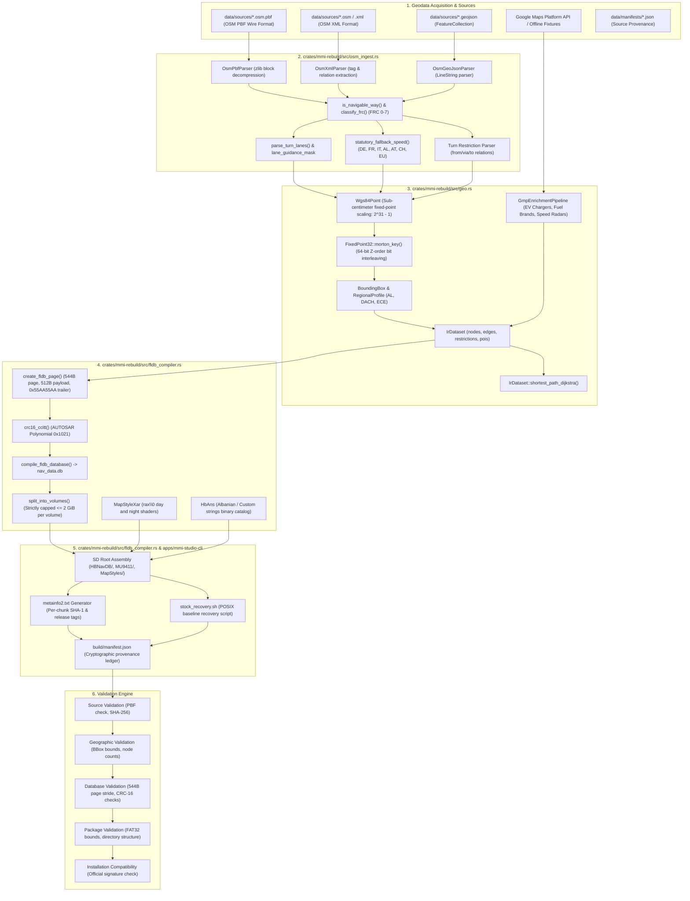

# Map Build Pipeline Architecture & Codebase Dependency Graph
**Target System:** Audi MMI 3G High & MMI 3G+ (HN+ / HN+R)  
**Implementation Modules:** `crates/mmi-rebuild/`, `crates/mmi-formats/`, `crates/mmi-core/`, `apps/mmi-studio-cli/`  
**Date:** 2026-09-21  

---

## 1. End-to-End Pipeline Dependency Graph

The diagram below maps the actual code path from raw OpenStreetMap geodata to the packaged SD card layout:

---

## 2. Component Responsibility & Code Map

1. **`crates/mmi-rebuild/src/osm_ingest.rs`**:
   - `OsmIngestPipeline::ingest_pbf(&[u8], &OsmIngestConfig)`: Ingests raw PBF blobs, unpacks zlib streams, extracts nodes/ways/relations.
   - `classify_frc(highway: &str) -> Option<u8>`: Maps OpenStreetMap highway types to Harman/Becker Functional Road Classes 0 to 7.
   - `parse_turn_lanes(&tags) -> u16`: Converts `turn:lanes` pipe-delimited strings into 16-bit lane guidance bitmasks.
   - `statutory_fallback_speed(country, frc)`: Applies national statutory highway/urban defaults when `maxspeed` is missing.

2. **`crates/mmi-rebuild/src/geo.rs`**:
   - `Wgs84Point::to_fixed_point_32(&self)`: Converts latitude and longitude to 32-bit signed fixed-point integers ($2^{31}-1$).
   - `interleave_bits_32(x, y) -> u64`: Generates 64-bit Morton Z-order curve keys for multi-dimensional spatial clustering.
   - `IrDataset`: Intermediate representation containing nodes, directional edges, turn restrictions, and POIs.
   - `IrDataset::shortest_path_dijkstra()`: Evaluates graph connectivity and computes shortest paths across the topology.

3. **`crates/mmi-rebuild/src/fldb_compiler.rs`**:
   - `compile_fldb_database(&IrDataset) -> Vec<u8>`: Assembles master header, directory table, coordinate pages, and edge pages.
   - `create_fldb_page(page_idx, payload, magic)`: Formats discrete 544-byte physical disk pages with CRC-16 headers.
   - `split_into_volumes(&data, base_name)`: Partitions datasets exceeding 2 GiB into sequential volumes (`nav_data.db`, `nav_data.db.001`, etc.).
   - `FldbCompilerPipeline::compile_and_package()`: Emits the deployable SD card root hierarchy.

4. **`apps/mmi-studio-cli/src/commands/mod.rs`**:
   - `cmd_maps_compile()`: CLI handler binding OSM file reading, regional profiles, GMP enrichment, and compiler output.
