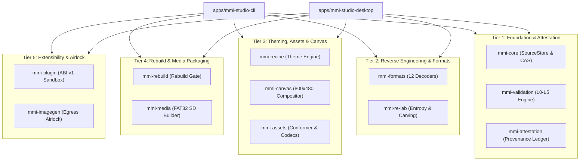

# Architecture — Component Hierarchy & Crates

The Audi MMI Studio codebase is organized into 12 modular Rust crates under `crates/` and two user-facing applications under `apps/`.

---

## 1. Five-Tier Architectural Hierarchy

---

## 2. Component Responsibility Matrix

| Crate | Layer | Primary Responsibility | Key External Dependencies |
| :--- | :--- | :--- | :--- |
| `mmi-core` | Foundation | Immutable `SourceStore`, BLAKE3 Content-Addressed Storage (`CAS`), `StageStore`, `MMIProject` data model. | `blake3`, `rusqlite`, `thiserror` |
| `mmi-validation` | Foundation | 6-tier (`L0` to `L5`) automotive validation engine, target hardware profiles. | `mmi-core`, `serde`, `serde_json` |
| `mmi-attestation` | Foundation | SHA-256 build attestation ledger, emergency stock recovery packaging. | `mmi-core`, `sha2`, `hex` |
| `mmi-formats` | Reverse Eng | Decoders and binary parsers for all 12 proprietary MMI 3G formats (RQ-001..RQ-012). | `mmi-core`, `flate2` |
| `mmi-re-lab` | Reverse Eng | Sliding Shannon entropy profiler, virtual hex viewer, byte histogram, signature carver. | `mmi-core` |
| `mmi-assets` | Assets | Bitmap decoding, Lanczos3 resampler, constraint checker, font metric calculators. | `mmi-core`, `image` |
| `mmi-recipe` | Theming | Declarative JSON theme recipes, cryptographic journals, cross-train rebase engine. | `mmi-core`, `mmi-assets`, `sha2` |
| `mmi-canvas` | Canvas | 800x480 pixel framebuffer compositor, Day/Night/Reduced palette renderer. | `mmi-core`, `mmi-assets` |
| `mmi-rebuild` | Packaging | Identity-Rebuild Gate, deterministic stage normalizer, signed artefact protection. | `mmi-core`, `mmi-formats` |
| `mmi-media` | Packaging | FAT32 SD media builder with 32 KiB cluster geometry, volume splitter, QNX simulator. | `mmi-core`, `walkdir` |
| `mmi-imagegen` | Extensibility | Isolated Egress Airlock, brand/PII prompt sanitization, offline mock provider. | `mmi-core`, `tempfile` |
| `mmi-plugin` | Extensibility | Plugin SDK (`ABI_VERSION = 1`), memory-isolated execution sandbox, dynamic discovery. | `mmi-core`, `mmi-formats` |
| `mmi-studio-cli` | Applications | Standalone command-line workstation binary with 22 subcommands. | All workspace crates, `clap` |
| `mmi-studio-desktop`| Applications | Tauri v2 native IPC bridge and React 18 / TypeScript graphical workstation. | `mmi-core`, `mmi-formats`, `mmi-canvas` |
