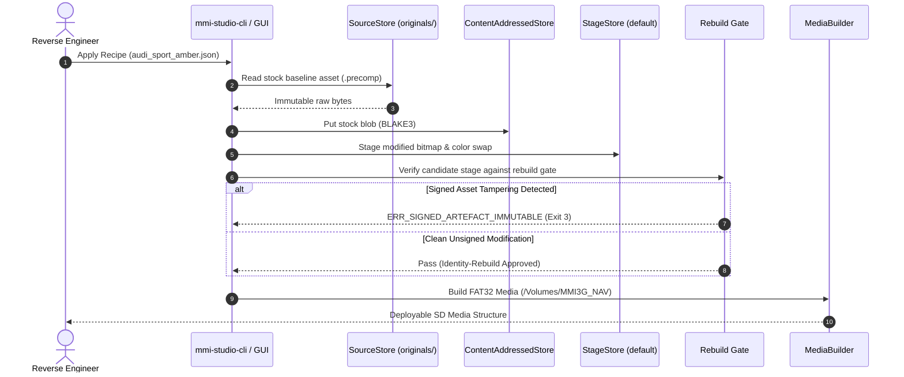

# Architecture — Data Flow & Pipelines

This document traces data flows across the ingestion, reverse engineering, theming, rebuilding, and deployment media packaging pipelines.

---

## 1. End-to-End Asset Transformation Pipeline



---

## 2. Desktop IPC Bridge Data Flow

In `mmi-studio-desktop`, heavy binary data is processed strictly within Rust native threads. No multi-megabyte binary payloads are passed across the JSON IPC boundary into the JavaScript webview:

```text
[React 18 Frontend]
        │
        │ 1. Request slice (path, offset: 0x1000, length: 256)
        ▼
[Tauri IPC Bridge (src-tauri/src/ipc.rs)]
        │
        │ 2. Direct byte slice via SourceStore
        ▼
[mmi-core / mmi-re-lab]
        │
        │ 3. Formatted HexRows & Shannon Entropy Floats
        ▼
[React 18 Virtualized Canvas Grid] (Renders <1ms)
```

---

## 3. The 6-Tier Validation Pipeline

```text
Staged Update Directory
   │
   ├─► [Tier 0: Magic Byte Check] ──────────► (Pass: Known Header)
   │
   ├─► [Tier 1: Section Layouts] ───────────► (Pass: Valid Offsets)
   │
   ├─► [Tier 2: Asset Conformance] ─────────► (Pass: Dimensions & Alpha Match)
   │
   ├─► [Tier 3: UI Margins & Strings] ──────► (Pass: No Text Clipping)
   │
   ├─► [Tier 4: Rebuild Determinism] ───────► (Pass: Signed Assets Untouched)
   │
   └─► [Tier 5: Target Hardware Profile] ───► (Pass: Partition Limits Respected)
                                                    │
                                                    ▼
                                           Verdict: BUILD READY
```
