# Architecture — System Overview

**Audi MMI Studio** is an offline-first engineering workstation designed for deep structural analysis, reverse-engineering, visual exploration, controlled modification, and deterministic repackaging of Audi Multi Media Interface (MMI 3G+ / HN+) infotainment software packages.

---

## 1. Architectural Principles

1. **Corpus Immutability**:
   The reference firmware corpus in `originals/` is structurally immutable. All file access is mediated by `SourceStore` in `mmi-core`, which prevents modification.
2. **Deterministic Execution**:
   All asset processing, packaging, and hashing routines produce bit-for-bit identical outputs across runs regardless of host environment.
3. **Signed Artefact Protection**:
   Binary payloads containing detached cryptographic signatures (`.pkg.sig`, `.dat.sig`, QNX IFS/IPL bootloaders) are strictly analysis-only. The Identity-Rebuild Gate permanently locks signed binaries to prevent vehicle bricking.
4. **Zero-Telemetry Boundary**:
   The workstation binds no public listening sockets, makes zero external network calls, and transmits no crash reporting or user analytics.
5. **Airlocked Extensibility**:
   Any external AI generation flows through an isolated Egress Airlock (`mmi-imagegen`) equipped with strict brand/PII redaction, token keychain isolation, and offline mock support.

---

## 2. High-Level Architecture Diagram

```mermaid
flowchart TD
    subgraph HostSystem [Offline Engineering Workstation]
        CLI["mmi-studio-cli (Headless Entry Point)"]
        GUI["mmi-studio-desktop (Tauri v2 + React 18)"]
        
        subgraph CorePlatform [Rust Workspace Engine]
            Core["mmi-core (SourceStore & CAS)"]
            Formats["mmi-formats (12 Decoders)"]
            Assets["mmi-assets (Conformer & Bitmaps)"]
            Canvas["mmi-canvas (800x480 Compositor)"]
            Recipe["mmi-recipe (Theme Engine & Rebase)"]
            Rebuild["mmi-rebuild (Identity-Rebuild Gate)"]
            Validation["mmi-validation (6-Tier Hierarchy)"]
            Media["mmi-media (FAT32 SD Builder)"]
            Attestation["mmi-attestation (Provenance & Stock)"]
        end
        
        subgraph StorageLayers [Storage Segregation]
            Orig[("originals/ (Read-Only)")]
            CAS[(".mmistudio/cas/ (BLAKE3)")]
            Stage[(".mmistudio/stages/ (Copy-on-Write)")]
            Out[("output/ (Deployable Media)")]
        end
    end
    
    CLI --> CorePlatform
    GUI --> CorePlatform
    CorePlatform --> StorageLayers
```

---

## 3. Scope & Operational Constraints

- **In Scope**: Reverse engineering of the 12 proprietary automotive binary formats, UI asset extraction and conforming, declarative theme authoring, cross-train rebasing, deterministic rebuild verification, and FAT32 SD deployment media packaging.
- **Out of Scope**: Tampering with digital signatures, reverse-engineering factory activation keys, or bypassing security access codes. All such materials are classified as `OUT OF SCOPE — DOCUMENT ONLY`.
