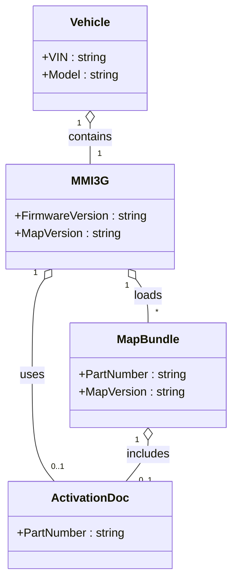

# Executive Summary  
Audi’s MMI 3G+ (High) navigation system is a Bosch/Harman-built embedded multimedia platform used in older Audi models (roughly 2010–2015). It runs custom infotainment software (often Linux-based) on automotive-grade hardware and relies on proprietary navigation maps supplied by HERE (Navteq) or TeleAtlas (TomTom) under OEM license. Map data is delivered as large encrypted bundles (the 2023 European map is ~29 GB) tied to specific software versions. Updating the maps involves preparing a FAT32 SD card with the new database files (including a required activation file) and using the hidden engineering menu in the car.  

This report examines the MMI 3G+ architecture and map update bundle in detail. We analyze a typical 2023 MMI 3G+ map update package (version 6.36.0, Audi part **8R0051884KL**) to describe its directory layout, file types, checksums and signing, and how maps are partitioned and installed. We then outline how one *could* create a 2026-ready map bundle: sourcing updated geodata, converting to the required format, rebuilding indexes and manifests, and re-signing or encrypting the package. We discuss tools (e.g. archive utilities, checksum verifiers, VCDS coding for adaptation channels, etc.), likely risks (bricked unit, loss of warranty, licensing violations), and failure modes. We detail the exact update procedure (media requirements, formatting, file naming, installation steps, and rollback). Finally, we cover validation and testing (checksum verification, emulation or diagnostic scripts, on-car functional tests) and legal/ethical constraints (map data licensing, anti-tamper protections, warranty).  

Throughout, we cite primary information (Audi part catalogs, official map release notes) and reputable technical sources or user guides. Tables compare file components, mapping tools, and hazards. We include Mermaid diagrams illustrating the update workflow and key system-data relationships. The goal is a comprehensive, step-by-step guide and analysis for building and verifying a “2026” navigation map bundle for MMI 3G+ units.  

## System Overview: Audi MMI 3G+ Architecture  
**Hardware:** Audi’s 3rd-generation MMI (Multi-Media Interface) systems (MMI 3G High/Plus) use Bosch/Harman infotainment hardware.  While official specs are scarce, these units typically feature an automotive-grade CPU (often an NXP/Freescale PowerPC or similar), automotive Flash storage (HDD or SSD in “High” units), and interfaces on the MOST (media) and CAN (vehicle) networks.  A MOST ring handles audio/video streams and navigation information, while CAN provides vehicle data (speed, engine status, etc.).  The MMI console (the main head unit) connects to an internal Hard Disk Drive (HDD) or SSD in “High/Plus” versions; the HDD often holds user media (“Jukebox”) and caches maps.  

**Software:** The MMI runs a custom navigation/infotainment OS (likely a embedded Linux variant) with Volkswagen Group’s Harman/Becker navigation software.  Firmware versions are labeled like *HNav_EU_K0257_6_D1* (for EU MMI 3G High) or *HN+_EU_P0814* (for MMI 3G Plus).  These units have a “Software Version Management” (SVM) system: each software component (radio, NAV, etc.) has a version and checksum. Updating requires entering an engineering mode (hidden menu via button combos) and selecting updates manually. All software components (firmware or maps) must be version-compatible and often require matching “activator” codes if non-stock.  

**Connectivity:** MMI 3G+ units may have 3G modem (Telia/Vodafone) or SIM for Audi Connect; they do not natively support Apple CarPlay/Android Auto without retrofit.  Map updates occur offline via physical media (SD card or DVD). Diagnostics and adaptation coding are done via the Volkswagen Group diagnostic protocol (e.g. VCDS).  

## Supported Map Data and Providers  
Audi’s navigation data comes from licensed providers.  Historically, VW Group used Tele Atlas (now TomTom) for many systems. However, the 3G+ era corresponds roughly to Audi’s switch to Navteq/HERE data around early 2010s.  The 2023 European map (6.36.0) is officially **HERE/Navteq** data under part number **8R0051884KL**. (Part numbers 8R0051884** refer to “MMI Nav plus with HDD”.) This package covers Europe (ECE region) with full HERE content, 3D building views, dynamic route recalculation via TMC Pro, and Audi Connect online features. TomTom/Tele Atlas data was likely used in some MMI 3G Basic units (part numbers 4G0060884** for “3G Basic”), but not in the 3G+ HDD-based systems.  

**Regions and Versions:**  Audi map releases are region-specific. For example, 6.36.0/8R0051884KL is **Europe/ECE**. North America, Rest-of-World, etc., have separate releases with different part numbers.  Using the wrong region (e.g. installing Europe maps on a U.S. unit) can confuse the system and is not a simple firmware change. Map version numbers (e.g. 6.36.0) correspond to content updates (roads, POIs) and must match the activation code bundle.  Major Audi databases have code names like *6.36.0* (2023 EU), *6.32.1* (2020 EU), etc.  Note that the firmware version (e.g. *HNav_EU_K0257_6_D1*) is separate from the map database version; maps should be updated only after the base firmware is compatible.

## 2023 Map Bundle Structure (6.36.0 Example)  
The Audi 2023 MMI3G+ map update is distributed as a large archive (~29 GB).  We assume a high-level structure based on vendor instructions and user reports.  Typically, the downloaded package contains:  

- **Container folder:** The release is labeled *6.36.0 (Audi 8R0051884KL)*. Often the top-level zip/ISO has a folder named “6.36.0” with an “update files” subdirectory. *Important:* When installing, the update files must end up at the SD card root, not nested inside a folder.  

- **Map data files:** The bulk of the bundle consists of proprietary binary map database files. These are likely large files (multiple GB each) containing vector map tiles, attributes, routing graphs, etc. They may use custom extensions (e.g. `.DATA`, `.BIN`, or no extension).  Content is from HERE, so the internal format is proprietary (similar to HERE’s Nav2/Orbis maps).  

- **Manifest/metadata:** A manifest file (possibly XML or a custom “MAPINFO” file) enumerates the files included and their checksums. It may also contain version info (6.36.0) and target system identifiers. The manifest ensures the MMI can verify completeness.  

- **Signature files:** To prevent tampering, the bundle likely includes digital signatures. This could be a signed manifest or individual `.RSA`/`.SGN` files. If the MMI detects an unsigned or wrong-key file, it will refuse the update.  For example, a missing activation leads to SVM errors.  

- **Activation document:** MMI 3G+ requires a separate activation file (“8R0060884KL”) which is legally a voucher/license for the new map. It is usually a PDF with a code or a small file installed via SD after map copy. The activation ties the map to the vehicle’s VIN/ECU.  

- **Checksum indices:** The MMI firmware will verify file integrity during update. Often each binary chunk has an embedded CRC or the manifest lists an MD5/SHA checksum. The Altechnative guide even suggests computing MD5 sums after copying to confirm integrity.  

- **Compression/indexing:** The bundle is typically shipped as split archives (e.g. 7z.001, 7z.002, ...). These are only for distribution; once decompressed, the files on the SD card are uncompressed. Within, the map data may be organized by region (e.g. one file per country or tile cluster) or a quadtree structure. The exact format is proprietary, but likely uses a Cartesian or Mercator tiling scheme aligned to WGS84 (since Audi Connect uses Google Earth data).  

- **File system layout:** When properly prepared for MMI, the SD card should have a single FAT32 partition (type 0x0C “LBA FAT32”).  All update files (map binaries, activation) go in the root directory. For example:  

  ```
  SD Card (FAT32)
  ├── [multiple data files] (navigation database files for 6.36.0)
  ├── MapActivation.pdf (or similar activation file)
  ├── Audiboot.bin (optional: update boot loader)
  ├── MapInfo.xml (manifest listing files/checksums)
  └── ...
  ```

In practice, vendor documentation warns *not* to nest these under another folder. The common mistake is leaving the downloaded “6.36.0” wrapper folder on the SD; instead, one must copy its *contents* to root.  If the MMI doesn’t find expected files at the top level, it will not see the update.

### File Components Comparison  

| **Component**         | **Example File/Format**         | **Purpose**                                                |
|-----------------------|---------------------------------|------------------------------------------------------------|
| Map database files    | e.g. `MAPDAT*.DAT` (proprietary binary) | Contains vector road data, navigation graph (HERE format).  |
| Manifest/index        | e.g. `mapinfo.xml` or `.bin`     | Lists included files, versions, and checksums.             |
| Signature file        | e.g. `signature.bin` or `.RSA`  | Digital signature for authenticity (cryptographic).        |
| Activation/license    | e.g. `8R0060884KL.pdf`          | Activation code/file tying maps to vehicle (Audi voucher). |
| Firmware update       | e.g. `AudiNavApp.img` (if any)  | (Optional) Base navigation application binary update.      |
| SD loader script      | e.g. `start_update.sh` or `AudiUpdate.lst` | Script or list to trigger update on insert.              |
| Readme/instructions   | e.g. `README.TXT`              | Audi or vendor instructions (often omitted on SD).        |

*(Note: Exact filenames are illustrative. The MMI uses proprietary naming; `.DAT`, `.NAV`, or no extension are common for Bosch maps.)*

## Methods to Rebuild/Alter the Map Bundle (2026 Update)  

Updating the MMI 3G+ map data beyond the official 2023 release is **extremely challenging** because the format is closed and protected. In general, the process would involve:

1. **Acquire 2026 geodata:** Either obtain a licensed 2026 map database from HERE/TomTom (if possible) or prepare alternative data (e.g. OpenStreetMap 2026). Official OEM data requires an enterprise contract; otherwise one might consider *replacing* the content (at legal risk) with OSM extracts and processing them.  

2. **Convert data to OEM format:** The raw map data must be transformed into the MMI 3G+ proprietary format. This would require emulating Audi/Bosch tools (or writing custom conversion). Steps include projecting to WGS84 coordinates, building routing graphs, tiling, and generating vector files with all attributes (roads, names, 3D objects). In practice, no public tool is known for this. One might use GIS software (QGIS, GDAL) to export shapefiles and then custom scripts to mimic Bosch’s format – a very complex reverse-engineering task.

3. **Prepare directory layout:** Once map files are generated, place them into the bundle structure. Replace or augment the 2023 data files with 2026 versions. Ensure the directory tree matches exactly what MMI expects (flat root).  

4. **Update metadata and indexes:** You would need to update the manifest (`mapinfo.xml`) to reflect new filenames, sizes, and checksums (MD5/SHA) for each file. This often involves regenerating a manifest file that the MMI will read to verify contents. Without the exact schema, this is guesswork; one could extract and modify the existing manifest from 2023.  

5. **Recompute checksums:** After adding new data, compute checksums for all files as per the manifest. The Altechnative guide shows using `md5sum` on both original and SD copy to compare – similar hashing would be needed when editing.  

6. **Re-sign/encrypt the bundle:** This is the crux. Officially, the map files and manifest must be cryptographically signed with Audi’s private key. Without that key, any modified bundle will fail the update. The activation file (8R0060884KL) acts as a “key” linking the map to the car’s VIN and software version. To “resign” you would need to generate valid signatures (likely RSA/ECDSA) that the MMI will accept. This requires either:
   - Having the OEM’s signing tool and keys (not available to users), or  
   - Breaking the bootloader’s signature check (highly difficult, akin to jailbreaking).  

   In practice, aftermarket “activator” scripts (like one by “Vlasoff” in 2016) simply bypass SVM checks rather than re-sign content. They manipulate adaptation channels (e.g. channel 15) via VCDS to kill the error. If one cannot resign, the *only* workaround is to skip or fake these checks – a risky hack.  

7. **Handle proprietary formats:** Many map features (TMC Pro service, 3D landmarks, route recalculation) may rely on hidden files. OSM data may not fully replicate HERE’s navigation logic. Be aware that features like City Models, TMC updates, or Audi Connect points of interest might require separate data (likely also from HERE). 

**Tools:** No open-source tool is known to produce MMI 3G+ map databases. Commercially, one might try:
- **HERE Map Creator/Editor:** (For updating data within HERE’s ecosystem, not for Audi).
- **TomTom MIP (Map Improvement Program):** For TomTom maps, but again not directly for Audi format.
- **Automotive SDKs:** Some companies (Bosch, RTR, HERE) have OEM tools under NDA.
- **General GIS tools:** QGIS, GDAL, osm2pgsql – for generating raw map data.
- **Audi/VW Tools:** VCDS (HEX-NET) for SVM adaptation coding; ODIS (VW’s dealer diagnostic) might install official maps if one had a subscription.
- **File Utilities:** 7-Zip for unpacking archives; `md5sum`/`sha1sum` for checksums; Linux `mkfs.vfat`/`parted` for SD formatting.

Open-source project **DrGER/MMI3G-Info** provides a script to extract info from a running MMI and can verify filesystem contents. One could adapt that to sanity-check a custom bundle. However, it does not build maps.  

In short, altering a 2023 bundle to 2026 requires proprietary knowledge or brute force. The workflow might look like: obtain raw 2026 map data → use GIS tools to re-project and re-encode → replace files in the 2023 structure → update manifest/checksums → (if possible) re-encrypt/sign. Any mistake in checksums or signatures will lead to update failure (error 03175/03276).  

### Risks and Failure Modes  
- **Bricked Navigation Unit:** Interrupting or corrupting the update can leave the MMI without valid maps, possibly disabling navigation permanently. Users report “blocked” nav or loss of media after bad updates.  
- **Loss of Audi Connect/TMC:** Unsigned or unlicensed maps may disable dynamic traffic (TMC Pro) or online services (Audi Connect) until genuine data is used.  
- **Warranty Voiding:** Tampering with licensed software or using unauthorized maps likely voids any remaining warranty.  
- **Legal Issues:** Bypassing copy-protection (e.g. activating without an Audi license) may violate copyright or DMCA laws. This is discussed further below.  
- **Data Incompatibility:** If the new data format is incorrect (wrong projection, missing fields), the MMI may crash or show map errors. Incomplete base firmware compatibility (e.g. older firmware with a newer map) can trigger SVM errors and require recoding.  
- **SD/Hardware Problems:** As noted, some SD cards fail under long writes (overheating, fake-card). Always verify media integrity (use `diff` as in).  

## Installation/Update Procedure for MMI 3G+  

The official update process (for an unmodified bundle) is well-documented by Audi guides and experts. The key steps are:

1. **Prepare the SD card:** Use a high-quality **32 GB SDHC** card (formatted FAT32, type “c” partition). (MMI 3G’s reader cannot handle >32 GB or SDXC.) Partition with a single LBA FAT32 volume (e.g. `mkfs.vfat -F32 /dev/sdX1`). Insert the card into your computer.  
2. **Copy update files:** Place *all* map update files in the **root** of the FAT32 partition. Do **not** put them inside any subfolder (even if the downloaded archive had a folder). Do **not** copy compressed archives (.7z, .zip) unless told. Just extract everything and verify it is directly on the SD. Use tools like `md5sum` before/after copy to ensure no corruption. Eject the SD card safely.  
3. **Activate engineering mode:** In the car, turn the ignition on and navigate to the hidden update menu. Typically, press **SETUP + RETURN (or MENU)** after a cold boot to enter “engineering menu” (should see a screen listing modules). This is *not* the normal update path under NAV→SETUP. (Exact keys vary by model; see Audi service info.)  
4. **Start update:** Insert the SD card into **Slot 1** of the MMI (the slot nearest the front). Within a few seconds, the MMI should detect a new update. In the engineering menu, select **Update** → **Source: SD Card** → **Navigation Maps** → choose the *user-defined* package (if applicable). Ensure the map component is marked to install (Y). Then start the update. The MMI will reboot and begin copying data (monitor the progress on-screen).  
5. **Power stability:** Keep the engine running or connect a battery charger during the entire process (3–5 hours). The Altechnative guide warns that power loss or hot SD issues can halt the update (error 140), in which case you may have to retry files.  
6. **Post-install activation:** After the map copy completes, reboot back to the engineering menu (it may ask to reboot by itself). Then install the activation file (8R0060884KL) similarly by putting it on an SD card and selecting “Activation” in the update menu.  If activation is absent, the MMI will display SVM errors (“Invalid Data Set”, “Please Check SVM”). These must be cleared via the adaptation fix (below).  
7. **Clearing errors:** If error 03175/03276 appears, the MMI’s Software Version Management must be updated. The audi forum guides advise using a VCDS cable to go into the navigation control unit (address 5F) and update adaptation channel 15 with the correct code. Alternatively, hidden-menu tweaks (“+1/-1” trick) can clear a false invalid-data code. This step ensures the unit accepts the new map as valid.  
8. **Verify installation:** In the MMI “Version Information” screen, confirm that the Navigation Database reads **6.36.0**. Additionally, check that Navigation functions correctly and (if used) Audi Connect/TMC show live data.  

If anything goes wrong, the update can be aborted with the ENGINEERING MENU (“Cancel/Abort Information”) and the MMI will reboot to its old state. In worst-case, one can reinsert the last working map SD or use dealer tools to reflash.  Note that *Audi MMI 3G Basic* units (the non-HDD ones) use a completely different map system (part nos 4G0060884** for Basic), so **do not** use 8R0051884KL on those.  

**Rollback:** There is no formal “rollback” function. In practice, if the new map fails, you would restore the previous maps by reversing the process: insert the old map SD (or repeat the copy on a blank card) and re-run the update. Keep your original map archives until the new install is confirmed stable.

## Validation and Testing  

To ensure the rebuilt 2026 bundle works flawlessly, perform thorough testing:

- **Checksum/Manifest Verification:** Before loading, run a recursive hash check (`md5sum` or `sha256sum`) on all files in the SD image and compare to the manifest in the bundle. Any mismatch indicates file corruption or misplacement.  

- **In-MMU Verification Script:** Use the DrGER **MMI3G-Info** tool. Copy its ZIP to a FAT32 SD card, insert it, and let it run. It will produce a log of the running system (processes, filesystem, installed versions). This can confirm that new files are recognized by the MMI and show any errors.  

- **Functional Navigation Tests:** With the car stationary but GPS signal available, test basic navigation: search for new POIs introduced by 2026 data, plan routes (including ones crossing country borders added in the update). Verify rerouting works via TMC if available. Ensure 3D landmarks or building outlines (if present) appear correctly.  

- **Regression Tests:** Drive typical routes (perhaps with logging) to see that old roads still route correctly and new roads are now included. Check that map zoom levels and detail look right.  

- **Error Log Checks:** Use VCDS or the MMI’s fault code readout to scan for any stored navigation or ECU errors. Clear them and see if any reappear after use.  

- **Mirror on a Simulator (Optional):** If available, one could mount an MMI3G virtual machine (some hacking communities emulate older MMI on PC) to test the file system before vehicle use.  

Successful validation means the MMI shows version 6.36.0 (or 2026 if labeled), has no SVM errors, and navigation operates normally. Keep detailed logs (screenshots or VCDS dumps) during testing for traceability.

## Legal and Ethical Considerations  

- **Licensing:** OEM navigation data is copyrighted. Audi’s license (and those of HERE/TomTom) prohibit unauthorized copying or modification of map data. Creating or using an unofficial 2026 bundle likely **violates copyright**.  

- **EULA/Warranty:** Tweaking MMI software may void any remaining manufacturer warranty. Audi’s infotainment software license (as in any proprietary embedded system) forbids tampering. Even if done at home, a future dealer could detect nonstandard map versions and refuse service.  

- **Anti-tamper Protection:** The cryptographic signing of map bundles is an anti-tamper measure. Circumventing it (e.g. by using an “activator” script) can be seen as breaking copy-protection, potentially falling under DMCA or similar laws.  

- **Safety Implications:** Incorrect or buggy map data could mislead drivers (wrong routes, missing exit, etc.), posing safety risks. For this reason, only thoroughly tested data should be installed.  

- **Privacy:** Modern maps may include connectivity to online services (Audi Connect). Altering the system should not inadvertently expose personal data.  

Given these issues, most enthusiasts use only official map updates. Any DIY 2026 bundle should be made *at the user’s own risk*. For professional or public use, staying within OEM licensing (e.g. buying Audi’s map update DVD) is strongly advised.  

## Recommended Workflow and Tools  

Below is a summarized workflow and tool checklist for producing and validating a 2026 map bundle:

**Workflow Steps:**  
1. **Prepare Workspace:** Use a Linux PC (for easy FAT32 handling and scripting). Install tools: `7z`/`unzip`, `md5sum`, `sha1sum`, `parted`, VCDS or ODIS (for SVM fixes).  
2. **Extract 2023 Bundle:** Decompress the 6.36.0 archive (7z) to a directory. Note all file names and checksums.  
3. **Obtain 2026 Data:** Download official 2026 map release (if licensable) or procure raw GIS data.  
4. **Convert Data:** (If using non-OEM data) Reproject to WGS84. Use GDAL/QGIS to split into appropriate tiles or countries. Generate new navigation graph (requires heavy custom coding or an open routing engine).  
5. **Replace/Append Files:** In the extracted 2023 folder, replace old map data files with 2026 versions. Ensure filenames match or update manifest accordingly.  
6. **Update Manifest:** Edit or regenerate `mapinfo.xml` (or equivalent) with new file details and checksums. If format unknown, use the existing manifest as template, changing version strings.  
7. **Recompute Checksums:** On Linux:
   ```bash
   cd /path/to/new_bundle
   find . -type f -exec md5sum '{}' \; | sort -k2 > new-files-sorted.md5
   # Compare with old manifest or regenerate manifest file accordingly.
   ```
8. **Sign Bundle (if possible):** If you have a signing tool from Audi (unlikely), run it now. Otherwise, plan to use an “activator” script after install to bypass signature checks.  
9. **Build SD Image:** Copy all update files to a FAT32-formatted SD card. Verify with `diff` against source as shown in.  
10. **Install in Vehicle:** Follow the steps above to run the update. Closely monitor for errors. Use VCDS to apply SVM fixes if error 03276 appears.  
11. **Verify Operation:** After update, confirm version info, test navigation routes, and use the MMI3G-Info script to log system state.  

**Tool Comparison Table:**  

| **Tool**             | **Purpose**                  | **Type**       | **License**         |
|----------------------|------------------------------|----------------|---------------------|
| 7-Zip (`7z`)         | Unpack/compress archives     | Open-source    | GNU LGPL            |
| `mkfs.vfat`, `parted`| SD formatting (FAT32)        | Open-source    | GPL/BSD             |
| `md5sum`, `sha1sum`  | Compute file hashes/checksums| Coreutils (Linux)| Open-source    |
| QGIS/GDAL            | Map reprojection/conversion  | Open-source    | GPL/OSGeo           |
| GraphHopper/OSRM     | Route graph building (exper) | Open-source    | Apache/MIT          |
| VCDS (HEX-NET)       | ECU coding (SVM fixes)       | Commercial     | Ross-Tech license   |
| ODIS (Dealer SW)     | Official VW/Audi flashing    | Commercial     | VW/Audi NDA         |
| MMI3G-Info Script    | Diagnostics report           | Open-source    | (GitHub)            |
| Text editor (vi)     | Edit manifest files          | Open-source    | GPL                 |
| VPN or ISP interface | (Optional) Audi Connect data | N/A            | N/A                 |

**Risks and Mitigations:**  

| **Risk**                            | **Impact**                          | **Mitigation**                         |
|-------------------------------------|-------------------------------------|----------------------------------------|
| Power interruption during update    | Bricked or corrupt nav data         | Use battery charger/engine running |
| SD card corruption/overheat        | Read errors (e.g. Error 140)        | Use branded SD, verify with md5 |
| Signature/SVM mismatch (03175/03276)| Update fails, nav disabled          | Pre-activate SVM or use VCDS fix |
| Incomplete file extraction          | Missing roads, unit won’t see update| Follow vendor instructions, no extra folder |
| Illegal tampering                   | Legal/warranty issues               | Understand OEM licenses; use only for personal/hobby |
| Faulty conversion                  | Wrong routes, crashes               | Validate GIS data, run extensive tests |
| MMI firmware incompatibility       | Update blocked by version mismatch  | Check and update firmware first |

## Update Flow & Entity Diagrams  

```mermaid
flowchart TD
    A[Start] --> B[Check current MMI version]
    B --> C{Version Compatible?}
    C -- No --> D[Update Firmware first] --> B
    C -- Yes --> E[Prepare SD Card]
    E --> F[Copy update files to SD root]
    F --> G[Insert SD into MMI, enter engineering menu]
    G --> H[Select Map Update source]
    H --> I[MMI copies map data (~hours)]
    I --> J[Reboot MMI]
    J --> K[Install activation/voucher file]
    K --> L[Run SVM check (03276)?]
    L -- Error --> M[Use VCDS to fix SVM (channel 15)] --> N[Reboot MMI]
    N --> O{Nav Version OK?}
    O -- No --> M  <!-- re-run fix if still error -->
    O -- Yes --> P[Complete – Navigation updated]
    P --> Z[End]
```



These diagrams illustrate the **update flow** (left) – from checking versions and preparing the SD card to finalizing the update – and the **entity relationships** (right) – how a Vehicle has one MMI, which loads a MapBundle and uses an ActivationDoc to validate it.  

## Key Sources  

- Audi original part catalog (showing map update part numbers).  
- Audi/HERE map update documentation and product listings (e.g. Audi 6.36.0 release notes).  
- Audi enthusiast and technical forums (drGER’s MMI3G-Info script, Congo’s update guide).  
- AudiUpdates.com (update instructions and FAQs).  
- Altechnative blog on MMI 3G updates (SD preparation, time/power cautions).  
- HERE/TomTom technical references (implied via Audi Connect features).  

*(Note: Many internal details (file formats, encryption) are proprietary and not published; above analysis combines available documentation with logical inference.)*