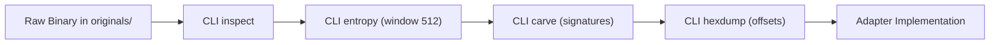
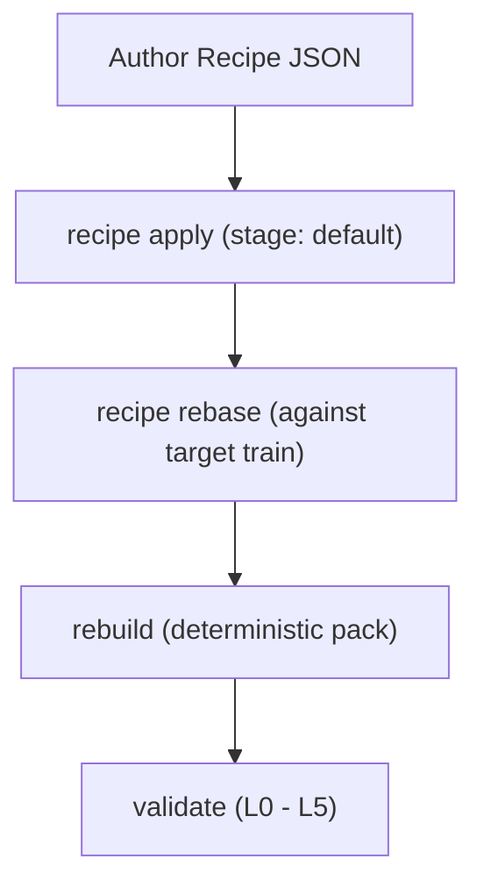

# User Guide — Common Workflows

This document details common end-to-end engineering workflows in **Audi MMI Studio**, from initial reverse-engineering research to full theme packaging.

---

## Workflow 1: Reverse-Engineering an Unidentified Binary

**Goal**: Identify container structures, detect embedded filesystems, and extract sub-assets from an unknown firmware file.



### Steps:
1. **Detect Basic Format**:
   ```bash
   ./target/release/mmi-studio-cli inspect originals/MU9411/HBNavDB/database.db
   ```
2. **Profile Structural Entropy**:
   ```bash
   ./target/release/mmi-studio-cli entropy originals/MU9411/HBNavDB/database.db --window 512
   ```
3. **Scan for Embedded Signatures**:
   ```bash
   ./target/release/mmi-studio-cli carve originals/MU9411/HBNavDB/database.db
   ```
4. **Examine Structure Boundaries**:
   ```bash
   ./target/release/mmi-studio-cli hexdump originals/MU9411/HBNavDB/database.db --offset 0x00 --length 256
   ```

---

## Workflow 2: Custom Theme Authoring & Cross-Train Rebasing

**Goal**: Create a custom theme recipe, apply it to a staging workspace, evaluate portability against another software train, and verify safety.



### Steps:
1. **Select or Author a Recipe**:
   Inspect pre-built themes like `recipes/audi_sport_amber.json` or write a custom JSON recipe defining color mappings and asset replacements.
2. **Apply Recipe to Staging**:
   ```bash
   ./target/release/mmi-studio-cli recipe apply \
     --recipe recipes/audi_sport_amber.json \
     --stage default
   ```
3. **Check Cross-Train Portability**:
   ```bash
   ./target/release/mmi-studio-cli recipe rebase \
     --recipe recipes/audi_sport_amber.json \
     --target-train originals/MU9411
   ```
4. **Repackage & Validate**:
   ```bash
   ./target/release/mmi-studio-cli rebuild --stage default --output output/rebuild_amber
   ./target/release/mmi-studio-cli validate output/rebuild_amber
   ```

---

## Workflow 3: Generating an Emergency Stock Recovery Package

**Goal**: Package genuine original firmware baselines into a self-contained emergency recovery SD bundle with standalone UART unbricking scripts.

### Steps:
1. **Build Recovery Package**:
   ```bash
   ./target/release/mmi-studio-cli stock-recovery \
     --baseline-train "HN+R_EU_AU_K0942_4_[8R0906961FB]" \
     --output output/stock_recovery_bundle
   ```
2. **Verify Output Artifacts**:
   - `output/stock_recovery_bundle/manifest.json` (Cryptographic inventory)
   - `output/stock_recovery_bundle/emergency_rollback.sh` (POSIX restoration script)
   - `output/stock_recovery_bundle/STOCK_SHA256SUMS` (Verification hashes)
3. **Store Recovery Bundle on Backup Media**:
   Copy the recovery bundle to a dedicated emergency SD card before attempting any experimental updates.
